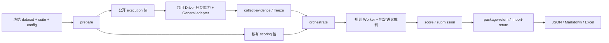

# 通用场景端到端自动化评测技术方案

更新：2026-09-23。本文解释 General E2E 的架构、数据流、轨迹采集与评分实现。接入步骤、共用 Driver 控制规则、Harness 进度统一见[集成契约](../e2e/端到端自动化评测Harness接入契约.md)；指标字段与公式见[指标说明](通用场景端到端自动化评测指标说明.md)。历史架构/版本演进见[方案快照](../e2e/archive/general/技术方案快照-20260923.md)。

## 1. 目标与范围

在桌面 Harness 中完成通用任务，归档真实执行过程与候选，再使用原任务规则和固定语义裁判评分。文件结果和纯回复均支持；不能把“没有生成文件”直接判为失败，也不能从最终文件补造工具轨迹。

首个冻结数据集为 `general-custom60-v1`：60 题，六类各 10，automated 19 / hybrid 35 / llm_judge 6。题意、rubric、原规则和权重保持不变；任务素材与私有评分材料分包，路径映射保留原文/发送 Prompt SHA。Env、Skills、Warmup、网络和工具需求按任务审计，详见[能力矩阵](../../../eval_general_e2e/datasets/audits/general-custom60-v1-capability-matrix.md)。

运行不依赖 Docker 或仓库 checkout。规则在私有 runtime 副本、独立 Python Worker 和锁定依赖中执行；目录/进程隔离用于取证和恢复，不宣称是恶意代码安全沙箱。题目 `timeout_seconds` 不限制 Harness 总执行时间，也不参与能力评分；UI、进程清理、规则 Worker/API 等基础设施保护独立处理。

## 2. 组件与数据流



| 组件 | 职责 / 入口 |
| --- | --- |
| prepare | dataset/suite/配置校验、execution/scoring 分包；`prepare_general_e2e_workspaces.py` |
| execute | 向 Harness 发送公开题目；Driver 共用控制能力由场景参数驱动，保存 General attempt 和原生绑定 |
| collect | 原始轨迹、标准事件、指标、任务进程收口、候选冻结、正式 execution record/receipt |
| orchestrate / score | 私有评分 attempt、原规则与 Codex/API 语义后端、合分与校验 |
| run | 只串联用户选择的阶段；恢复原阶段身份；打包/导入不与 collect-evidence 混用 |
| report | 消费选定 submission/return，复核哈希后生成同源报告；不重新做题或重新评分 |

源码根为 `eval_general_e2e/` 与 `tools/report/skills/general-e2e/`；`eval_e2e/` 是保留的旧入口。公共机制从 `tools/report/e2e-shared/` 和声明的 canonical 组件构建时 vendoring，七个 Skill 可独立分发，无跨 Skill 私有 import。构建入口为[独立发行构建器](../../../tools/e2e-build/build_general_release.py)，精确 Schema 见[contracts](../../../eval_general_e2e/contracts/README.md)。

## 3. 身份、目录与状态

逻辑身份为 `batch_id / unit_id / task_id / attempt_id`；原生 thread/turn/session/cwd 另行绑定，不用任务名、最近记录或目录 basename 代替。客户端不存在的原生 ID 保留 null。

```text
unit/
  manifest.json
  execution/tasks/<task-id>/      # 公开题面/素材，候选 workspace
  .general-e2e/                   # 控制状态、队列、采集暂存；不作为冻结结果
  evidence/tasks/<task-id>/<attempt-id>/
    candidate/workspace/
    trace/                       # 原始/标准轨迹、索引、绑定副本
    resource-metrics.json
    execution-record.json
    evidence-manifest.json
  score/                         # 终态后合入私有评分材料与独立 attempt
  receipts/
  submission.json
```

业务终态、证据完整性和评分有效性分别记录。一次发送、恢复、未知交互和进程控制遵守共用契约；General adapter 负责把原生状态映射为其 Schema，不把 Web execution receipt 当成 General collect receipt。

## 4. 轨迹采集分析

### 4.1 原生来源与稳定绑定

| Harness | 身份/终态来源 | 轨迹与用量来源 | 实现入口 |
| --- | --- | --- | --- |
| AstronStudio | `state.sqlite` 的 projection threads/turns/projects，绑定 thread/turn/cwd | 同库 `provider_runtime_events`，按目标 thread + turn 导出；usage 的 last/total、工具 item 和 turn 边界 | [archive_astronstudio_trace.mjs](../../../tools/report/skills/general-e2e/collect-general-e2e/scripts/archive_astronstudio_trace.mjs)、`collect_astronstudio_resource_metrics.mjs` |
| WorkBuddy | runtime API 冻结的 request/session/workspace 状态，保存在 native binding | `~/.workbuddy/projects/<编码目录>/<sessionId>.jsonl` 提供响应/usage；runtime snapshot 提供原生时间、工具内容和最终回复 | [collector.mjs](../../../tools/report/skills/general-e2e/collect-general-e2e/drivers/workbuddy/collector.mjs)、[JSONL/timing 组件](../../../tools/report/e2e-shared/workbuddy-jsonl-metrics/index.mjs) |
| QwenWork | `agents.db` 的 sub_chats/chats/local_projects/projects；session/conversation/sub-chat/project/cwd 与 stream/taskStatus | `~/.qwenworkcn/projects/<编码目录>/<session>.jsonl` 核对 Prompt/内容；`logs/sessions/<编码目录>/<session>/segments/*.jsonl` 提供 request/response/tool/turn | [session-state.mjs](../../../tools/report/skills/general-e2e/execute-general-e2e/drivers/qwenwork/session-state.mjs)、[collector.mjs](../../../tools/report/skills/general-e2e/collect-general-e2e/drivers/qwenwork/collector.mjs) |
| DoubaoWork | General 尚无已交付来源映射 | Web trajectory 的工具小计不能直接变成 General 轨迹/回执 | 接入范围见共用契约进度 |

数据库用于身份定位，不必然是 Token 数据源。WorkBuddy 的 `session_usage/credit_json` 只保留历史积分线索；不从数据库大小、mtime、WAL 大小或 UI 上下文容量推算消耗。路径来自冻结配置和实际绑定，示例目录不是固定用户名假设。

### 4.2 采集、归一化和校验

1. 对已绑定原生身份做受限读取。SQLite 使用受控只读快照/一致备份；原始文件按本 session 范围定位，拒绝多候选、越界和来源漂移。
2. 原始事件保留原序号、时间、原生 ID 与文件 SHA/size；标准 transcript 至少表达用户/助手内容、工具调用、参数、结果、路径和先后关系。
3. 工具请求与结果按真实 call ID 关联；重复结果不重复计数，孤立/缺失结果保留缺口。未知工具结局不能从 `completed` 或最终文件推断为 success。
4. 按 attempt 排除其他会话、既往轮次、后台服务和无法绑定的子代理；目标主任务之外的消耗不混入指标。
5. `trace-index` 指向多个 raw artifact、标准 transcript 和 binding；General CB-B 使用支持 nullable 原生字段的 trace-index v2，具体字段由 Schema 校验。

QwenWork 的用户/助手/附件等内容行仍需 session/cwd 归属；已识别的 worktree-state/file-history-snapshot 系统 metadata 可缺少行内 cwd，缺失覆盖原样保留。Token 还要冻结开关 probe/config，按 runtime Profile 和 request ID 与主 turn 终值对账，详见指标说明。

### 4.3 轨迹如何进入评分

规则消费冻结的标准 transcript 和候选；Codex 语义评分任务可沿索引分页回查原件，API 后端按冻结预算构建证据并记录截断/遗漏，不能据此宣称具有相同的按需回查能力。不能用空 transcript、最终文件猜测或控制 Agent 的说明替代必需事件。

数据集能力审计表明：22 题出现 transcript 接口/辅助代码，按可达调用图仅 19 题接收、12 题实际读取；10 题有工具解析器，6 题实际调用。不能把未执行的辅助函数当作评分需求。工具别名、参数、路径、调用/结果次序必须以实际 grader 验证；缺必需轨迹按评分异常/不可评分处理。

### 4.4 正式归档与冻结

collector 的暂存目录不等于正式交付。finalizer 校验 package/dataset/attempt/Prompt、可信终态、raw/normalized/resource 哈希，再精确清理本题进程，等待零残留与 Workspace 静默，复制完整候选并多次核对树哈希后原子发布。

候选默认 exact-all，按任务保留 Git、二进制与受限链接；不能沿用 Web 的统一 `.git` 禁止项。持续残留、迟到写入、来源或候选漂移阻止发布。完成后 `--verify-only` 同时校验冻结候选与原源目录。旧结果补采只新增哈希绑定的 supplement、新 return 和新报告，不覆盖旧 record/score。

## 5. 评分与结果交接

- automated：仅原自动规则；hybrid：规则与语义按冻结权重合分；llm_judge：指定语义协议。
- 默认 `codex-agent-judge-v1` 为每题独立评分任务；API 为显式可选后端，不因控制端或模型错误静默切换。
- 评分使用私有 runtime 副本、后置 GT 和固定依赖。原候选只读；grader/runtime 异常属于评测异常，规则正常运行给出的 0 分仍有效。
- `score.json` 校验后才能生成 submission；回传包含所选 attempt 与证据清单，排除 runtime 和敏感用户 profile。重复导入幂等，冲突回传需显式选择。
- 报告只消费已选回传，区分执行状态、valid/evaluation_error/unscored 和资源覆盖，公式见指标说明。

## 6. 边界与维护

UI/原生身份/发送/停止/恢复逻辑在共用契约按 Harness 定义；General 的文件/纯回复、规则、轨迹准入与回执在本场景 adapter 定义。两场景接口/序列化可以不同，但不能各自改变“不确定不重发”“未知交互不代答”等控制不变量。

支持矩阵、未完成项、当前源码/发行、固定 smoke 和后续操作只维护在[集成契约](../e2e/端到端自动化评测Harness接入契约.md#integration-progress)。本方案描述结构和现有采集路径，不构成新的平台或生产准入。
