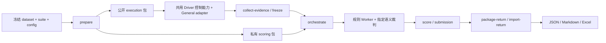

# 通用场景端到端自动化评测技术方案

更新：2026-09-29。本文解释 General E2E 的架构、数据流、轨迹采集与评分实现。接入步骤、共用 Driver 控制规则、Harness 进度统一见[集成契约](../e2e/端到端自动化评测Harness接入契约.md)；指标字段与公式见[指标说明](通用场景端到端自动化评测指标说明.md)。历史架构/版本演进见[方案快照](../e2e/archive/general/技术方案快照-20260923.md)。

## 1. 目标与范围

在桌面 Harness 中完成通用任务，归档真实执行过程与候选，再使用原任务规则和固定语义裁判评分。文件结果和纯回复均支持；不能把“没有生成文件”直接判为失败，也不能从最终文件补造工具轨迹。

首个冻结数据集为 `general-custom60-v1`：60 题，六类各 10，automated 19 / hybrid 35 / llm_judge 6。题意、rubric、原规则和权重保持不变；任务素材与私有评分材料分包，路径映射保留原文/发送 Prompt SHA。Env、Skills、Warmup、网络和工具需求按任务审计，详见[能力矩阵](../../../eval_general_e2e/datasets/audits/general-custom60-v1-capability-matrix.md)。

运行不依赖 Docker 或仓库 checkout。规则在私有 runtime 副本、独立 Python Worker 和锁定依赖中执行；目录/进程隔离用于取证和恢复，不宣称是恶意代码安全沙箱。题目 `timeout_seconds` 不限制 Harness 总执行时间，也不参与能力评分；UI、进程清理、规则 Worker/API 等基础设施保护独立处理。

## 2. 组件与数据流


```mermaid
flowchart LR
  D[冻结 dataset + suite + config] --> P[prepare]
  P --> E[公开 execution 包]
  P --> S[私有 scoring 包]
  E --> H[共用 Driver 控制能力 + General adapter]
  H --> C[collect-evidence / freeze]
  C --> O[orchestrate]
  S --> O
  O --> J[规则 Worker + 指定语义裁判]
  J --> U[score / submission]
  U --> R[package-return / import-return]
  R --> V[JSON / Markdown / Excel]
```

| 组件 | 职责 / 入口 |
| --- | --- |
| prepare | dataset/suite/配置校验、execution/scoring 分包；`prepare_general_e2e_workspaces.py` |
| execute | 向 Harness 发送公开题目；Driver 共用控制能力由场景参数驱动，保存 General attempt 和原生绑定 |
| collect | 原始轨迹、标准事件、指标、任务进程收口、候选冻结、正式 execution record/receipt |
| orchestrate / score | 私有评分 attempt、原规则与 Codex/API 语义后端、合分与校验 |
| run | 只串联用户选择的阶段；恢复原阶段身份；打包/导入不与 collect-evidence 混用 |
| report | 消费选定 submission/return，复核哈希后生成同源报告；不重新做题或重新评分 |

源码根为 `eval_general_e2e/` 与 `tools/report/skills/general-e2e/`；`eval_e2e/` 是保留的旧入口。公共机制从 `tools/report/e2e-shared/` 和声明的 canonical 组件构建时 vendoring，七个 Skill 可独立分发，无跨 Skill 私有 import。构建入口为[独立发行构建器](../../../tools/e2e-build/build_general_release.py)，精确 Schema 见[contracts](../../../eval_general_e2e/contracts/README.md)。

## 3. 身份、目录与状态

评测根目录默认是控制 Harness 会话项目的当前工作目录，用户显式指定 `--round-root` 时覆盖；不绑定固定 round1 或开发者路径。控制 Harness 使用已安装 Skill 的绝对脚本路径，不先切换到 Skill 安装目录。入口位于 [run_general_e2e.py](../../../tools/report/skills/general-e2e/run-general-e2e/scripts/run_general_e2e.py) 与 [round_workspace.py](../../../tools/report/skills/general-e2e/run-general-e2e/scripts/round_workspace.py)：

- `install-unit` 验证单端 execution ZIP 并安装到对应 Harness 目录，不要求提前消费私有评分包。
- `init-round` 校验管理员提供的完整批次，在同一根目录安装所选 Harness。用户文件保留，已有评测目录冲突拒绝覆盖。
- `prepare-score` 在正式采集后，以评分 ZIP 和同批次 report-config 创建本 Harness 内的编排与单题入口。当前 report-config 与评分 ZIP 分开生成，必须随评分包交付。

这些命令由 run Skill 响应用户 Prompt 调用；常规使用方式见[指导手册](../../guides/general-e2e/通用场景端到端自动化评测指导手册.md#使用方法)。逻辑身份为 `batch_id / unit_id / task_id / attempt_id`；原生 thread/turn/session/cwd 另行绑定，不用任务名、最近记录或目录 basename 代替。不存在的原生 ID 保留 null。

```text
<round-root>/
  AstronStudio/                  # WorkBuddy、QwenWork、DoubaoWork 同构
    manifest.json
    execution/tasks/<task_id>/   # PROMPT.md + workspace/
    score/tasks/<task_id>/
      workspace/                # 当前评分 runtime 入口；归档时指向冻结候选
      private-scoring/           # 当前评分的私有材料入口
      trace/                    # 标准轨迹、原始日志和索引入口
      attempts/<scoring_attempt_id>/
      current                   # 本单元内相对入口，不自动覆盖旧选择
    score/.orchestrations/      # 实际评分 attempt、编排状态和 submission
    evidence/tasks/<task_id>/<execution_attempt_id>/
      candidate/workspace/
      trace/
      resource-metrics.json
      execution-record.json
      evidence-manifest.json
    receipts/
    .general-e2e/               # 队列、采集暂存和恢复状态
  reports/                      # 核验后发布的同源报告
  deliverables/                 # 回传与研发 ZIP、外部回执
  .general-e2e/                 # 输入缓存、内部批次、依赖和审计
```

执行 UI 派发固定单槽。AstronStudio、WorkBuddy、QwenWork 的新批量队列默认后台3槽（可配置1–8），DoubaoWork默认3槽（1–3）；语义评分默认3槽，由独立编排管理。AstronStudio probe 冻结的 execution_concurrency 与 initial_concurrency 均为3。队列恢复沿原冻结槽位，实际原生重叠仍从执行证据核算。

轮次目录、批次、发行和 attempt 分别管理。框架修复、单题重试或重评分在同一 Harness 下保留新旧 attempt 和显式选择，不默认重建一套整批工作根；数据集、范围或被评配置改变时才重新冻结批次。未知发送不能通过覆盖或重建目录消除。

业务终态、证据完整性和评分有效性分别记录。一次发送、恢复、未知交互和进程控制遵守共用契约；General adapter 负责把原生状态映射为其 Schema，不把 Web execution receipt 当成 General collect receipt。标准报告入口的正式输出仍位于内部 batch 下，控制 Harness 核验后发布到根目录 reports，保留原回执及来源映射。

## 4. 轨迹采集分析

### 4.1 原生来源与稳定绑定

| Harness | 身份/终态来源 | 轨迹与用量来源 | 实现入口 |
| --- | --- | --- | --- |
| AstronStudio | `state.sqlite` 的 projection threads/turns/projects，绑定 thread/turn/cwd | 同库 `provider_runtime_events`，按目标 thread + turn 导出；usage 的 last/total、工具 item 和 turn 边界 | [archive_astronstudio_trace.mjs](../../../tools/report/skills/general-e2e/collect-general-e2e/scripts/archive_astronstudio_trace.mjs)、`collect_astronstudio_resource_metrics.mjs` |
| WorkBuddy | runtime API 冻结的 request/session/workspace 状态，保存在 native binding | `~/.workbuddy/projects/<编码目录>/<sessionId>.jsonl` 提供响应/usage；runtime snapshot 提供原生时间、工具内容和最终回复 | [collector.mjs](../../../tools/report/skills/general-e2e/collect-general-e2e/drivers/workbuddy/collector.mjs)、[JSONL/timing 组件](../../../tools/report/e2e-shared/workbuddy-jsonl-metrics/index.mjs) |
| QwenWork | `agents.db` 的 sub_chats/chats/local_projects/projects；session/conversation/sub-chat/project/cwd 与 stream/taskStatus | `~/.qwenworkcn/projects/<编码目录>/<session>.jsonl` 核对 Prompt/内容；`logs/sessions/<编码目录>/<session>/segments/*.jsonl` 提供 request/response/tool/turn | [session-state.mjs](../../../tools/report/skills/general-e2e/execute-general-e2e/drivers/qwenwork/session-state.mjs)、[collector.mjs](../../../tools/report/skills/general-e2e/collect-general-e2e/drivers/qwenwork/collector.mjs) |
| DoubaoWork | 原生 IM 消息快照绑定 conversation、用户/回复 message、request session、project 和完整 workspace；结合原生完成字段或经独立校验的取消/错误证据确定终态 | 显式 session 的 `trajectory.jsonl` 与滚动归档、本地工具 started/settled 回调及上传结果账本合并；原生 elapsed block 和生命周期采样提供双耗时，Token/模型请求计量仍不可用 | [runtime-messages.mjs](../../../tools/report/e2e-shared/doubaowork/runtime-messages.mjs)、[bound-evidence.mjs](../../../tools/report/e2e-shared/doubaowork/bound-evidence.mjs)、[General collector](../../../tools/report/skills/general-e2e/collect-general-e2e/drivers/doubaowork/collector.mjs) |

数据库用于身份定位，不必然是 Token 数据源。WorkBuddy 的 `session_usage/credit_json` 只保留历史积分线索；不从数据库大小、mtime、WAL 大小或 UI 上下文容量推算消耗。路径来自冻结配置和实际绑定，示例目录不是固定用户名假设。

DoubaoWork 已支持 macOS x86_64、本地、值守的 General 执行与正式证据收口。2.31.3 的 [r28 同发行五题证据](evidence/doubaowork-macos-general-20260924/five-same-release-r28.json)覆盖三路原生重叠、执行、完整轨迹、评分、回传与报告；2.31.6 另有正常单题、显式取消及限定传输错误的[材料闭环证据](evidence/doubaowork-macos-hardening-20260924/README.md)。这些是各自范围的验证，不将旧版本五题成绩外推为新版全部加固或其它平台通过。

DoubaoWork 的采集来源与绑定方式如下：

- **原生消息**：通过 CDP 只读取得已初始化的 `native-im.useMessageStore.getState()`，冻结当前目标 conversation 的用户/助手消息。校验一次发送、用户 Prompt 回读 SHA、project ID，以及 `general_task_param.client_option.workspace` 和 `agent_task_param.workspace`；原生 request session、reply message 与 conversation 的语义分别保留。General 映射为 `session_id=conversation_id`、`turn_id=reply_message_id`、`thread_id=null`，原生 request session 单列在扩展字段，不伪造不存在的 thread。
- **会话轨迹**：原生路径示例为 `~/Library/Application Support/DoubaoWork/Default/.doubaowork/agent_mode/workspace/.sessions/<conversation-id>/agents/<agent-id>/system/trajectory.jsonl`。它可能只有用户消息或仅保留滚动片段，所以还需归档采样版本并与本地工具证据合并；不是读取 SQLite 就能得到完整过程。
- **工具与生命周期**：发送前安装受本 attempt/workspace 约束的原生工具 observer 和生命周期 observer。前者保存真实调用参数、结果及上传账本，后者保存绑定 request/query/reply/conversation 的 `task_finish.receiveTimestamp`；采样结束恢复原回调和定时器。原件在控制目录保存并以 SHA 引入正式采集，不用控制器自述补造事件。

### 4.2 采集、归一化和校验

1. 对已绑定原生身份做受限读取。SQLite 使用受控只读快照/一致备份；原始文件按本 session 范围定位，拒绝多候选、越界和来源漂移。
2. 原始事件保留原序号、时间、原生 ID 与文件 SHA/size；标准 transcript 至少表达用户/助手内容、工具调用、参数、结果、路径和先后关系。
3. 工具请求与结果按真实 call ID 关联；重复结果不重复计数，孤立/缺失结果保留缺口。未知工具结局不能从 `completed` 或最终文件推断为 success。
4. 按 attempt 排除其他会话、既往轮次、后台服务和无法绑定的子代理；目标主任务之外的消耗不混入指标。
5. `trace-index` 指向多个 raw artifact、标准 transcript 和 binding；General CB-B 使用支持 nullable 原生字段的 trace-index v2，具体字段由 Schema 校验。

QwenWork 的用户/助手/附件等内容行仍需 session/cwd 归属；已识别的 worktree-state/file-history-snapshot 系统 metadata 可缺少行内 cwd，缺失覆盖原样保留。Token 还要冻结开关 probe/config，按 runtime Profile 和 request ID 与主 turn 终值对账，详见指标说明。

DoubaoWork 的多源合并由 [readBoundNativeEvidence](../../../tools/report/e2e-shared/doubaowork/bound-evidence.mjs)和 [trajectory-merge.mjs](../../../tools/report/e2e-shared/doubaowork/trajectory-merge.mjs)执行：

1. 原生用户确认、助手回复、Prompt、project/workspace、request 和终态重新交叉核验；支持实时消息与已验证的历史 API 消息 Profile。不能将 UI idle、单次工具错误或控制端断连直接当成原生终态。
2. 本地 started/settled 按真实 call ID 与同 agent 的 uploaded 结果账本逐项对账。已在原生 TTL 内观察并持久化的账本可在后续淘汰后验证；首次采样过晚、身份或内容冲突、覆盖不全仍拒绝。对已独立确认的非成功终态，可保留经核验的上传子集，但不能发布完整工具总量。
3. `trajectory-observations` 保存滚动片段及来源摘要；相同 ID/内容的回放去重，矛盾内容拒绝。完整原生模型轨迹覆盖全部已见调用/结果且逐项对账时，采用其模型事件顺序，并另存本地执行时点；其它来源只在能证明前缀/交叠或先后关系时合并。无法证明的跨来源顺序保留 `partial`，不强行按本地完成时间排序。
4. 标准 transcript 输出用户/助手、`tool_call/tool_result`、原始参数/结果及 raw 引用；未映射内容块、远端工具覆盖不足、多模态结果未验证等继续显式记录缺口。工具结束不等于业务成功，不据此生成工具成功率。
5. 显式取消须同时验证本次取消意图、停止点击回执、原生 `Broken/Broken` 与同 request 前后台空闲。原生传输错误也须命中已验证 Profile 并确认空闲；当前限定 2.31.6 的 `Error/Error`、status 4、stage 1、错误码 `710020702`，不推广到所有错误。缺失轨迹/回复/结束时间按非成功分支保留 partial，不补造终态事件。

已支持的 DoubaoWork 指标与轨迹完整性分别判断：

| 字段 | 当前计算与限制 |
| --- | --- |
| `tools.call_count` | 已绑定本地工具协议与 session 轨迹的 call ID 去重并集。成功终态、原生工具证据、内容块和远端调用覆盖满足条件时发布 observed 总量；否则 `value=null / status=partial`，已验证调用只放 `known_subtotals`。工具数量完整不自动证明跨来源顺序完整 |
| `timing.agent_duration_seconds` | 原生 `elapsed_block.end_time_s - start_time_s`，含工具与客户端处理；缺失或非成功任务未提供该区间时为 null，不是纯模型推理耗时 |
| `timing.duration_seconds` | 发送边界至同一 request 的本机 `task_finish.receiveTimestamp`，由[生命周期采样](../../../tools/report/e2e-shared/doubaowork/runtime-lifecycle.mjs)绑定。只有历史服务端完成时间、没有本机完成采样时为 null，不能跨钟域相减；取消/错误采用发送至观察到原生终态且空闲的时间，明确包含观察等待 |
| Token、Cache Read/Write、推理 Token、模型请求数、HTTP 尝试数 | 当前标准资源记录均为 `null/unavailable`；SSE 连接数、分块数或原生 request session 数不等于模型调用数 |
| 上下文占用 / 订阅消费展示 | `context_window_usage`、`commerce_usage_data_v1` 单独保存在[原生资源观测](../../../tools/report/e2e-shared/doubaowork/resource-observations.mjs)；不换算为累计 Token、正式积分或金额 |

r28 五题的工具总量为 23 次、原生任务耗时合计 383 秒、流程耗时合计 395.3 秒，均覆盖 5/5；Token 和请求计量仍不可用。该冻结样本说明 `trace=complete` 可以与资源 `collection.status=partial` 同时成立，不能因部分资源未知就把已验证的工具和耗时也清零。

### 4.3 轨迹如何进入评分

[trace_handoff.py](../../../tools/report/skills/general-e2e/score-general-e2e/scripts/trace_handoff.py) 在评分准备时读取正式执行记录绑定的 trace-index，验证 identity/session、文件 SHA/大小及标准轨迹路径，将标准 transcript、原始会话、绑定证据和索引复制进本题评分 attempt 的 `trace/`。macOS 可使用文件系统克隆；不链接回其他执行工作空间，也不复制整个客户端数据库。

`attempt-manifest.json.trace_bundle` 固定交接清单 SHA；verify 复核全部原件及 `private/transcript.jsonl` 与 trace 标准轨迹的一致性。`prepare-rescore` 传递同一冻结 trace 包。语义证据目录提供 `raw_trace`、`trace_index`，Codex Judge 按 catalog/file 分页读取。新单元由 `.general-e2e/round-unit.json` 标记并要求完整交接；legacy 兼容和经审核的失败产物准入显式保留，不能伪造缺失轨迹。

规则消费冻结的标准 transcript 和候选；Codex 语义评分任务可沿索引分页回查原件，API 后端按冻结预算构建证据并记录截断/遗漏，不能据此宣称具有相同的按需回查能力。不能用空 transcript、最终文件猜测或控制 Agent 的说明替代必需事件。

数据集能力审计表明：22 题出现 transcript 接口/辅助代码，按可达调用图仅 19 题接收、12 题实际读取；10 题有工具解析器，6 题实际调用。不能把未执行的辅助函数当作评分需求。工具别名、参数、路径、调用/结果次序必须以实际 grader 验证；缺必需轨迹按评分异常/不可评分处理。

DoubaoWork 同样按公共证据门禁进入评分。在执行 `completed`、候选稳定及其它校验通过的前提下，仅缺资源覆盖的合法 partial 回执可以走标准内容评分；工具轨迹不完整时，仅在[评分入口](../../../tools/report/skills/general-e2e/score-general-e2e/scripts/score_general_e2e.py)确认缺口属于允许集合、且冻结 automated 规则只消费 Workspace、不读取轨迹/回复也不含语义 rubric 后，才允许 `automated-workspace-only/v1`。这不是对任意 partial 的豁免；依赖缺失过程证据的规则或语义评分继续拒绝。

### 4.4 正式归档与冻结

collector 的暂存目录不等于正式交付。finalizer 校验 package/dataset/attempt/Prompt、可信终态、raw/normalized/resource 哈希，再精确清理本题进程，等待零残留与 Workspace 静默，复制完整候选并多次核对树哈希后原子发布。

DoubaoWork 的 General collector 输出根限定在 unit 内 `.general-e2e/collection/`，返回 `COLLECTED_NOT_FINALIZED`。随后由专属 [finalize.mjs](../../../tools/report/skills/general-e2e/collect-general-e2e/drivers/doubaowork/finalize.mjs)注入真实 macOS cleanup hook 接入公共 finalizer；清理按目录身份、PID/启动时间/命令等核对本题进程，不接受外部 success 占位。General 与 Web 共用原生证据核心，正式 Schema、场景包校验和回执仍由各自 adapter 生成。

正式证据根为 `E=evidence/tasks/<task-id>/<attempt-id>/`（相对 unit）。归档布局示例如下；`E/trace/trace-index.json` 指向标准 transcript、绑定副本和实际取得的 raw 文件，资源指标与执行记录独立保存。缺少可选来源时不生成占位原件：

```text
E/trace/raw/runtime-messages.json             # 绑定的原生消息
E/trace/raw/trajectory.jsonl                  # 当次原生轨迹
E/trace/raw/trajectory-observations/          # 滚动版本与 index.json
E/trace/raw/native-tools.json                 # started/settled、uploaded 账本
E/trace/raw/native-lifecycle.json             # 同 request 的本机完成采样
E/trace/raw/native-resource-observations.json # 窗口占用、订阅展示等独立观测
E/trace/raw/normalization-diagnostics.json    # 去重、覆盖与顺序诊断
E/resource-metrics.json                      # General 标准指标及覆盖
E/execution-record.json                      # 正式执行回执中的任务记录
```

取消、原生失败或发送确认恢复时，还归档对应的意图、终态观察或确认依据。正式记录保留执行终态、trace 完整性与资源覆盖各自的状态，`--verify-only` 按原来源与冻结哈希复核。

候选默认 exact-all，按任务保留 Git、二进制与受限链接；不能沿用 Web 的统一 `.git` 禁止项。持续残留、迟到写入、来源或候选漂移阻止发布。完成后 `--verify-only` 同时校验冻结候选与原源目录。旧结果补采只新增哈希绑定的 supplement、新 return 和新报告，不覆盖旧 record/score。

## 5. 评分与结果交接

- automated：仅原自动规则；hybrid：规则与语义按冻结权重合分；llm_judge：指定语义协议。
- 默认 `codex-agent-judge-v1` 为每题独立评分任务；API 为显式可选后端，不因控制端或模型错误静默切换。
- 评分使用私有 runtime 副本、后置 GT 和固定依赖。原候选只读；grader/runtime 异常属于评测异常，规则正常运行给出的 0 分仍有效。
- `score.json` 校验后才能生成 submission；回传包含所选 attempt 与证据清单，排除 runtime 和敏感用户 profile。重复导入幂等，冲突回传需显式选择。
- 报告只消费已选回传，区分执行状态、valid/evaluation_error/unscored 和资源覆盖，公式见指标说明。

## 6. 边界与维护

UI/原生身份/发送/停止/恢复逻辑在共用契约按 Harness 定义；General 的文件/纯回复、规则、轨迹准入与回执在本场景 adapter 定义。两场景接口/序列化可以不同，但不能各自改变“不确定不重发”“未知交互不代答”等控制不变量。

支持矩阵、未完成项、当前源码/发行、固定 smoke 和后续操作只维护在[集成契约](../e2e/端到端自动化评测Harness接入契约.md#integration-progress)。本方案描述结构和现有采集路径，不构成新的平台或生产准入。

### 已完成轮次的迁移与清理

[archive_round.py](../../../tools/report/skills/general-e2e/run-general-e2e/scripts/archive_round.py) 的 import-final 验证最终 ZIP 成员、类型和 SHA，按逐题选择映射到稳定的 Harness 目录，记录原路径、新路径及摘要。评分原件和身份保持不变，原候选恢复只读权限；原评分轨迹、执行轨迹、后来补采轨迹分别标识为 as-scored、as-executed、supplemental，每题 evidence-selection.json 固定对应关系。归档 kind 为 archived，不作为旧队列恢复入口。

verify 核对映射和执行/评分身份；replay 只消费保留的最终 ZIP 与冻结批次配置，在内部临时目录重建报告输入并比较所有分数、资源、工具明细和 attempt 身份，不依赖旧控制目录。`verify-score --archived` 省略可重建 runtime 的存在检查，仍验证候选、轨迹、分数和审计 SHA；按当前规则复核审核证据内容，历史策略标识保持原回执值。

回传和归档完整保留 candidate-original、private、正式 evidence 中被哈希锁定的文件，包括其中的 __pycache__/.pyc；只排除可重建 runtime 等控制副本。历史包若遗漏冻结成员，只能从原 attempt 按原 manifest/候选清单逐项补回并留回执，不修改哈希或分数。

迁移、离线复算、Skill 发现入口都通过后，才按明确清单删除旧副本。保留最终 ZIP、四端有效材料、报告、冻结输入和必要审计；发现活动进程、未知目录或 Git 工作树时停止对应清理，不跟随符号链接删除外部目标。清理回执记录 du/df 和保留/删除项，APFS 目录占用差值不能直接视作物理释放空间。
