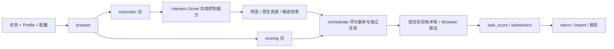

# Web 站点端到端自动化评测技术方案

更新：2026-09-23。本文说明从站点题目包到执行、轨迹采集、Browser 评分和回传报告的架构。共用 Driver 控制规则、集成步骤与各 Harness 进度见[统一集成契约](../e2e/端到端自动化评测Harness接入契约.md)，字段和公式见[Web 指标说明](Web站点端到端自动化评测指标说明.md)。操作流程见[用户手册](../../guides/web-e2e/Web站点端到端自动化评测指导手册.md)。

## 1. 场景边界与数据流

被测 Harness 根据公开题面和素材生成候选网站；独立评分 Agent 在只读评分副本上识别技术栈、启动站点，并通过当前评分入口要求的 Codex Desktop 内置 Browser 操作取证。控制器不补做网站、不修候选、不把评分消耗计入被测执行。

prepare 是管理员仓库入口；分发五个运行阶段 Skill：run、execute、orchestrate、score、report。每个 ZIP 构建期装入公共依赖，接收机器按安装清单核对名称、版本、内容 SHA；不能因题目批次不同重复安装同一运行内容，也不能只按同版本号忽略内容冲突。

`web-e2e-detailed-v1` 与 `artifactsbench-web-v1` 分别冻结，不能混包或混分。数据集/任务/Profile/Prompt/模型/权限/Judge/并发与发布身份由 manifest、task contract、运行状态共同锁定。

## 2. 共用 Driver 与场景 adapter

Driver 的应用发现、唯一控件、完整工作目录、配置回读、意图持久化、一次发送、原生身份、停止和恢复遵守共用契约。UI 单槽；后台执行和评分槽按已验范围配置。场景 adapter 负责读取 Web prepared task、候选策略、Web execution record/receipt 和评分交接。

当前代码位于 `tools/report/skills/web-e2e/execute-web-e2e/drivers/`，按 Harness 提供专属 UI/原生适配；通用底层从 `tools/report/e2e-shared/` vendoring。General 的独立 collect 阶段和回执 schema 不是 Web Driver 的输出格式，不能直接替换。

模型/权限须回读实际值。发送前落盘意图和 Prompt SHA；未知发送只续观原会话，不能补发。未知授权或无法唯一定位时暂停。题目 timeout 元数据不作为当前被测 Harness 的任务截止时间；历史 timeout 状态继续保留，UI/控制/评分基础设施限制按实际协议处理。

## 3. 轨迹采集分析

### 3.1 原生来源

| Harness | 唯一绑定与读取路径 | 解析分工 |
| --- | --- | --- |
| AstronStudio | 桌面 thread/turn 经 SQLite 反查 provider session/cwd，再定位 `.acode/sessions/.../<session>.jsonl` 或 acode-home-overlay/sessions | Web 从原生 rollout JSONL 解析；不同于 General 导出 SQLite provider events |
| WorkBuddy | 稳定 conversation/session ID + cwd，定位 `.workbuddy/projects/<编码目录>/<session>.jsonl` | 持久化响应/usage、工具 call ID 与消息时间；不能沿用 General runtime snapshot 的耗时结论 |
| QwenWork | agents.db 的 conversation/sub-chat/session/project/cwd；配合 `.qwenworkcn/projects/<编码目录>/<session>.jsonl` 与对应 logs/sessions/.../segments | transcript 确认归属；segments 提供主 turn request/response/tool/finished；精确运行时 Profile 决定 Token 是否可归一化 |
| DoubaoWork | 显式 conversation/session-directory/agent，读取绑定 session 的 agents/.../system/trajectory.jsonl | 已有工具已知小计的解析路径；native cwd、终态和完整用量缺证据时保持未知，不能凭 UI 文件生成宣称正式收口 |

[collectLocalMetrics](../../../tools/report/skills/web-e2e/execute-web-e2e/drivers/metrics/collect.mjs) 负责原生定位；[parsers](../../../tools/report/skills/web-e2e/execute-web-e2e/drivers/metrics/parsers.mjs) 复用场景无关的 native-parsers 并保持 Web 字段格式。原生来源按稳定 ID、完整 cwd 和目标主 turn 过滤，不遍历相近会话拼凑数据。

### 3.2 采集时机、完整性与落盘

资源采集在 Driver 可信终态之后、写入 execution record 时运行，使用隔离 Node 子进程和文件/遍历/输出限制。超时或原生缺失只使相应资源降级并记录原因，不改变执行终态、不触发 Prompt 重发。

`usage.collection` 记录采集器、session/attempt、字段 status/basis、来源路径/SHA、覆盖、已知小计、警告、后台与排除范围。当前 Web 资源接口以来源描述和哈希交接，不等同于 General 的完整 raw/transcript/trace-index v2 归档；不能在文档中把两条实现当成同一套正式 trace 包。

对 usage 与工具 ID 去重，排除既往轮次、后台操作和无法绑定的子代理。缺响应、隐藏零值、终值冲突、孤立结果等保留 partial/masked/unverified/unavailable；工具结果事件不重复计工具调用，不从调用次数推断工具成功率。

QwenWork 的进程级 Token 开关只对新客户端进程生效。Web Driver 在已授权、空闲且身份确认的启动路径注入开关；Profile 验证独立于开关存在。General 已验的 1.2.0 Profile 不自动成为 Web 的已验 Profile。

### 3.3 执行轨迹与评分证据的区别

执行轨迹用于身份、行为、工具与用量审计；站点分数依据 task contract/rubric 和实际浏览器交互。浏览器操作、截图、下载/原生对话框等观察属于独立评分证据，不能用被测 Agent 自报成功替代。

评分 Agent 写 criterion 的判断、理由、操作和 evidence；脚本校验完整性并确定性合分。需要 screenshot 的检查点必须有截图；工具不能完成所需交互/取证时记录评测异常，不解释为候选能力失败。

## 4. 候选与评分运行时

执行原件、只读评分副本和一次性 runtime 分开。Web 禁止 `.git`；已声明策略可保留 execution 中实际生成的 `.cache/.vite/node_modules`，按协议从哈希、复制或回传中排除并留清单，不能删除原件。旧回执按其原策略验证。

评分按 README、锁文件、scripts 和静态入口识别真实技术栈；不假设所有网站都是 Vite/React。端口冲突优先使用运行参数/环境覆盖；只有 Skill 明确允许的兼容分支可以最小修改 runtime 副本，并记录补丁，不能修复候选业务功能。停止本次服务器按 PID/进程组/服务身份，不按 Node/浏览器名称批量清理。

每题只注册精确的评分目录到 Codex Desktop 项目，独立任务、Browser、端口、evidence 和 private-scoring。失败评分 attempt 单独归档；恢复使用原 thread/cursor/attempt，不用新任务掩盖不确定性。

## 5. 评分、回传和报告

- 详细 Profile：内容、交互、视觉功能分与独立美观度；美观度与功能异常互不覆盖。
- ArtifactsBench：原始 0–10 整数锚点，再确定性归一化，不补详细维度或独立美观度。
- `score_input.json` 由 Agent 填证据；finalize/validate 生成并校验 task_score，候选双副本哈希必须一致。
- submission 原子生成，return ZIP + 外部 receipt 固定身份/成员 SHA；管理员导入幂等，冲突拒绝覆盖。
- report 按同批次/Profile/用例范围生成 JSON、Markdown、Excel。Web 既有异常零分语义与 General 有效分母不同，详见指标说明；不得在整理文档时改变协议。

源码入口：[Web Driver 契约](../../../tools/report/skills/web-e2e/execute-web-e2e/references/driver-contract.md)、[资源采集接口](../../../tools/report/skills/web-e2e/execute-web-e2e/references/resource-metrics.md)、[评分 JSON 契约](../../../tools/report/skills/web-e2e/score-web-e2e/references/scoring-contract.md)、[浏览器取证](../../../tools/report/skills/web-e2e/score-web-e2e/references/browser-interaction-scoring.md)。历史运行细节保留在 evidence/archive，当前进度只更新共用契约。
